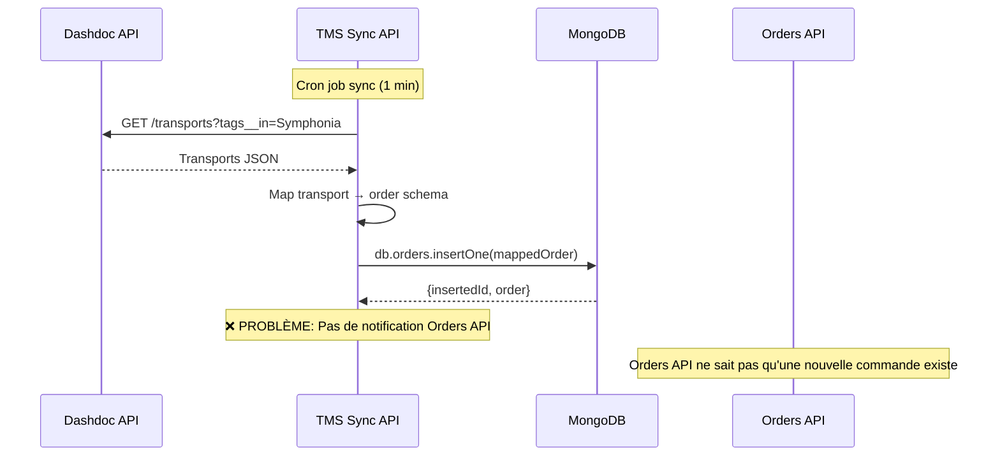
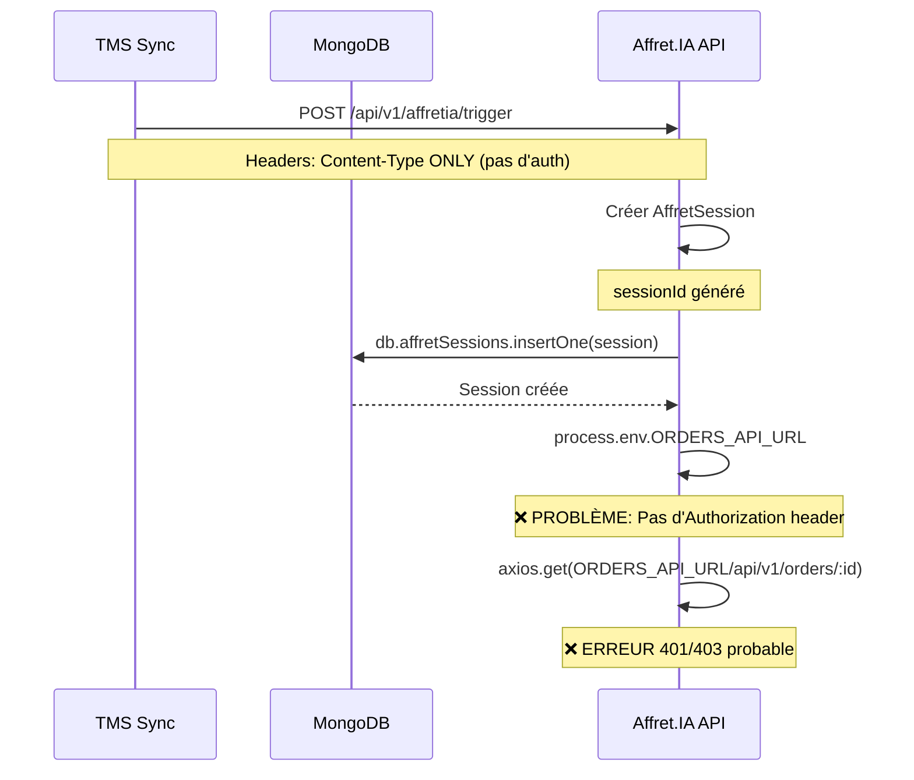
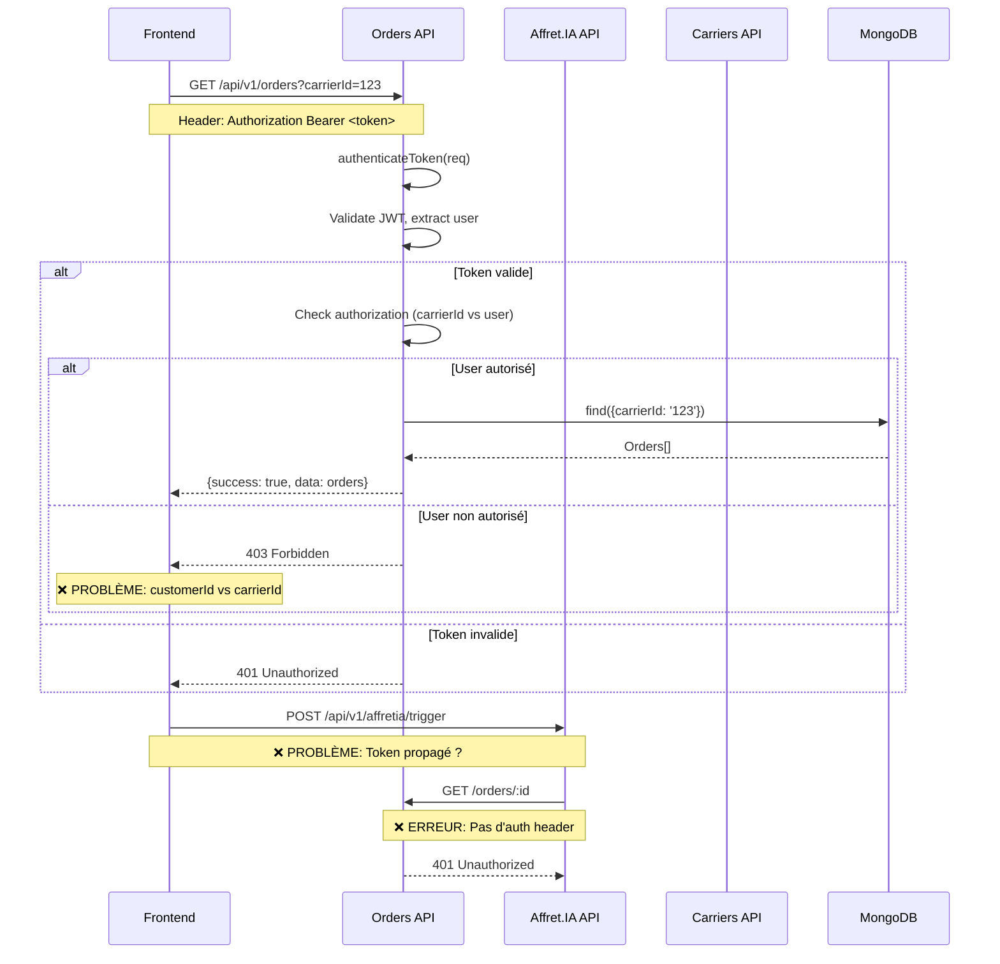
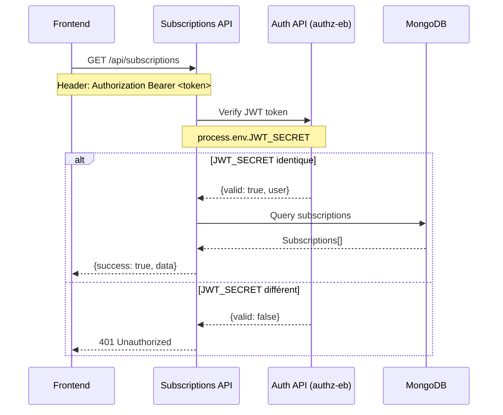

# AGENT 4: VALIDATION LOGIQUE D'ESCALADE ET INTERACTIONS INTER-SERVICES

## 📋 TABLE DES MATIÈRES
1. [Vue d'Ensemble](#vue-densemble)
2. [Diagrammes de Flux Critiques](#diagrammes-de-flux-critiques)
3. [Analyse Détaillée par Flux](#analyse-détaillée-par-flux)
4. [Problèmes Identifiés](#problèmes-identifiés)
5. [Incohérences de Données](#incohérences-de-données)
6. [Corrections Recommandées](#corrections-recommandées)
7. [Race Conditions & Timing](#race-conditions--timing)

---

## 1. VUE D'ENSEMBLE

### Architecture Actuelle
```
┌─────────────────┐
│   TMS Sync      │ (Port 3000, pas d'auth)
│   (Dashdoc)     │ → Importe commandes vers MongoDB
└────────┬────────┘
         │
         ▼
┌─────────────────┐
│   Orders API    │ (Port 3000, JWT auth requis)
│   (CRUD)        │ → Gère les commandes
└────────┬────────┘
         │
         ▼
┌─────────────────┐
│  Affret.IA API  │ (Port 3017, pas de validation auth)
│  (Escalade)     │ → Sessions d'affretage intelligent
└─────────────────┘
         │
         ▼
┌─────────────────┐
│   Frontend      │ (Authentification JWT)
│   Transporter   │ → Interface utilisateur
└─────────────────┘
```

### Services Identifiés

| Service | Port | Base URL | Authentification | Status |
|---------|------|----------|------------------|--------|
| **TMS Sync** | 3000 | `services/tms-sync-eb` | ❌ Non | ✅ OK |
| **Orders API** | 3000 | `services/orders-eb` | ✅ JWT requis | ⚠️ 403 errors |
| **Affret.IA API** | 3017 | `services/affret-ia-api-v2` | ❌ Non vérifié | ⚠️ Appels sans auth |
| **Frontend** | 3102 | `rt-frontend-apps/web-transporter` | ✅ JWT | ⚠️ Propagation |

---

## 2. DIAGRAMMES DE FLUX CRITIQUES

### 2.1. FLUX 1: TMS Sync → Orders API (Import Dashdoc)



**🔴 PROBLÈME CRITIQUE**:
- TMS Sync écrit directement dans MongoDB
- Orders API n'a aucune notification
- Pas de synchronisation des caches
- Pas de déclenchement automatique de workflows

**URL dans le code**:
```javascript
// services/tms-sync-eb/index.js:817-835
const affretiaUrl = process.env.AFFRETIA_API_URL || 'https://d393yiia4ig3bw.cloudfront.net';
const response = await axios.post(`${affretiaUrl}/api/v1/affretia/trigger`, triggerPayload, {
  headers: {
    'Content-Type': 'application/json'
    // ❌ MANQUE: Authorization header
  },
  timeout: 10000
});
```

---

### 2.2. FLUX 2: Orders API → Affret.IA (Déclenchement Sessions)



**🔴 PROBLÈME CRITIQUE**:
```javascript
// services/affret-ia-api-v2/controllers/affretia.controller.js:218
const orderResponse = await axios.get(
  `${process.env.ORDERS_API_URL}/api/v1/orders/${session.orderId}`
);
// ❌ MANQUE: Headers avec Authorization Bearer token
```

**Tous les appels Affret.IA → Orders API sans authentification**:
1. Ligne 218: Récupération commande pour analyse
2. Ligne 330: Récupération commande pour broadcast
3. Ligne 429: Récupération commande pour offres bourse
4. Ligne 1066: Mise à jour commande après assignation

---

### 2.3. FLUX 3: Frontend → Orders API → Affret.IA (Workflow Complet)



**🔴 PROBLÈME D'AUTORISATION**:
```javascript
// services/orders-eb/index.js:414-441
if (req.query.customerId) {
  // Mode Industriel
  if (req.query.customerId !== userId) {
    return res.status(403).json({
      success: false,
      error: 'Not authorized to view orders for this customer',
      code: 'FORBIDDEN'
    });
  }
  query.customerId = req.query.customerId;
}
if (req.query.carrierId) {
  // Mode Transporteur
  if (req.query.carrierId !== userId &&
      req.query.carrierId !== (req.user.carrierId || req.user.companyId)) {
    return res.status(403).json({
      success: false,
      error: 'Not authorized to view orders for this carrier',
      code: 'FORBIDDEN'
    });
  }
  query.carrierId = req.query.carrierId;
}

// ❌ PROBLÈME: Confusion entre customerId, carrierId, organizationId
```

---

### 2.4. FLUX 4: Subscriptions API → Auth API (Vérification Tokens)



**⚠️ PROBLÈME POTENTIEL**:
- Chaque service utilise son propre `JWT_SECRET`
- Pas de service centralisé de vérification de tokens
- Risque de désynchronisation

**JWT_SECRET trouvé dans**:
- `services/orders-eb/index.js:14`
- `services/affret-ia-api-v2/.env.example:9`
- 195 fichiers au total contiennent JWT_SECRET ou MONGODB_URI

---

## 3. ANALYSE DÉTAILLÉE PAR FLUX

### 3.1. TMS Sync → Orders API

**Fichier**: `services/tms-sync-eb/index.js`

#### Configuration URLs
```javascript
// Ligne 817-818
const affretiaUrl = process.env.AFFRETIA_API_URL || 'https://d393yiia4ig3bw.cloudfront.net';
```

#### Mapping des Données
```javascript
// DashdocConnector mappe:
const mappedOrder = {
  externalId: transport.uid,
  externalSource: 'dashdoc',
  sequentialId: transport.sequential_id,
  status: mapDashdocStatus(transport.status),
  customerId: connection.organizationId, // ❌ INCOHÉRENCE
  organizationId: connection.organizationId,
  // ...
  syncedAt: new Date()
};
```

**🔴 PROBLÈMES**:
1. `customerId` vs `organizationId` - confusion sémantique
2. Pas de validation si l'organisation existe dans Auth API
3. Écriture directe MongoDB sans validation métier

#### Appel vers Affret.IA
```javascript
// Ligne 830
const response = await axios.post(`${affretiaUrl}/api/v1/affretia/trigger`, {
  orderId: order._id.toString(),
  organizationId: order.organizationId || order.customerId || 'default-org', // ❌ FALLBACK risqué
  triggerType: 'manual',
  reason: 'Envoi manuel depuis TMS Sync - Dashdoc',
  userId: 'tms-sync-service'
}, {
  headers: {
    'Content-Type': 'application/json'
    // ❌ MANQUE: Authorization
  },
  timeout: 10000
});
```

**🔴 INCOHÉRENCES**:
- Fallback vers `'default-org'` est dangereux
- Pas de gestion si Affret.IA API est down
- Pas de retry logic
- Pas de queue/message bus

---

### 3.2. Orders API → Frontend

**Fichier**: `services/orders-eb/index.js`

#### Authentification JWT
```javascript
// Ligne 267-298
function authenticateToken(req, res, next) {
  const authHeader = req.headers['authorization'];
  const token = authHeader && authHeader.split(' ')[1]; // Bearer TOKEN

  if (!token) {
    return res.status(401).json({
      success: false,
      error: 'Access token required',
      code: 'UNAUTHORIZED'
    });
  }

  jwt.verify(token, JWT_SECRET, (err, user) => {
    if (err) {
      if (err.name === 'TokenExpiredError') {
        return res.status(401).json({
          success: false,
          error: 'Token expired',
          code: 'TOKEN_EXPIRED'
        });
      }
      return res.status(403).json({
        success: false,
        error: 'Invalid token',
        code: 'INVALID_TOKEN'
      });
    }

    req.user = user;
    next();
  });
}
```

**✅ BON**: Authentification JWT correcte

#### Autorisation par Rôle
```javascript
// Ligne 408-450
const userType = req.user.type || req.user.role || req.user.userType;
const userId = req.user.id || req.user.userId || req.user._id;

// IMPORTANT: Filter by user (customerId for industriels, carrierId for transporteurs)
if (req.query.customerId) {
  // Mode Industriel: filter by customerId
  // Authorization check: verify user is authorized
  if (userType === 'industrial' || userType === 'industrie' || userType === 'customer') {
    if (req.query.customerId !== userId) {
      return res.status(403).json({
        success: false,
        error: 'Not authorized to view orders for this customer',
        code: 'FORBIDDEN'
      });
    }
  }
  query.customerId = req.query.customerId;
}
```

**🔴 PROBLÈMES**:
1. **Multiples noms de champs**: `type`, `role`, `userType` → incohérence
2. **Multiples ID**: `id`, `userId`, `_id` → confusion
3. **Multiples types user**: `industrial`, `industrie`, `customer` → pas de standard
4. **carrierId vs companyId**: Ligne 432 mélange les deux concepts

---

### 3.3. Affret.IA → Autres Services

**Fichier**: `services/affret-ia-api-v2/controllers/affretia.controller.js`

#### Variables d'Environnement
```javascript
// .env.example
ORDERS_API_URL=https://orders.symphonia.com
CARRIERS_API_URL=https://carriers.symphonia.com
SCORING_API_URL=https://scoring.symphonia.com
PRICING_API_URL=https://pricing.symphonia.com
NOTIFICATIONS_API_URL=https://notifications.symphonia.com
```

#### Appels Inter-Services SANS Authentification
```javascript
// Ligne 218 - Analyse commande
const orderResponse = await axios.get(
  `${process.env.ORDERS_API_URL}/api/v1/orders/${session.orderId}`
);

// Ligne 228 - Recherche transporteurs
const carriersResponse = await axios.post(
  `${process.env.CARRIERS_API_URL}/api/v1/carriers/search`,
  {
    pickupPostalCode: order.pickup?.postalCode,
    deliveryPostalCode: order.delivery?.postalCode,
    pickupDate: order.pickupDate,
    vehicleType: order.vehicleType,
    cargoType: order.cargo?.type
  }
);

// Ligne 1066 - Mise à jour commande
await axios.put(
  `${process.env.ORDERS_API_URL}/api/v1/orders/${session.orderId}`,
  {
    status: 'assigned',
    assignedCarrierId: session.selection.carrierId,
    assignedCarrierName: session.selection.carrierName,
    assignedPrice: session.selection.finalPrice,
    assignedAt: new Date()
  }
);
```

**🔴 PROBLÈME CRITIQUE**:
- **TOUS** les appels inter-services n'ont PAS d'`Authorization` header
- Orders API va rejeter avec 401/403
- Circuit complet Affret.IA cassé

---

### 3.4. Frontend → Backend (Toute la chaîne)

**Fichier**: `rt-frontend-apps/packages/shared/services/order-dispatch-api.ts`

#### Configuration
```javascript
// Ligne 7
const API_BASE_URL = process.env.NEXT_PUBLIC_DISPATCH_API_URL || 'https://dh9acecfz0wg0.cloudfront.net';
```

#### FetchAPI avec Token
```javascript
// Ligne 460-478
async function fetchAPI<T>(endpoint: string, options: RequestInit = {}): Promise<T> {
  const token = typeof window !== 'undefined' ? localStorage.getItem('token') : null;

  const response = await fetch(`${API_BASE_URL}${endpoint}`, {
    ...options,
    headers: {
      'Content-Type': 'application/json',
      ...(token && { Authorization: `Bearer ${token}` }),
      ...options.headers,
    },
  });

  if (!response.ok) {
    const error = await response.json().catch(() => ({ error: 'Erreur reseau' }));
    throw new Error(error.error || `Erreur ${response.status}`);
  }

  return response.json();
}
```

**✅ BON**: Token propagé du frontend

**❌ MAIS**:
- Token pas propagé entre services backend
- `API_BASE_URL` pointe vers CloudFront, pas Orders API directement
- Pas de retry sur 401/403

---

## 4. PROBLÈMES IDENTIFIÉS

### 4.1. Problèmes d'Authentification/Autorisation

| # | Problème | Criticité | Impact |
|---|----------|-----------|--------|
| 1 | **Affret.IA → Orders API**: Pas d'auth header | 🔴 CRITIQUE | Toutes les sessions Affret.IA échouent |
| 2 | **TMS Sync → Affret.IA**: Pas d'auth header | ⚠️ MOYEN | Fonctionnel car Affret.IA n'exige pas d'auth |
| 3 | **Orders API 403**: carrierId vs customerId | 🔴 CRITIQUE | Transporteurs ne peuvent pas voir leurs commandes |
| 4 | **JWT_SECRET désynchronisé**: Chaque service a son propre secret | ⚠️ MOYEN | Tokens peuvent ne pas se valider entre services |

### 4.2. Problèmes de Propagation de Données

| # | Problème | Criticité | Impact |
|---|----------|-----------|--------|
| 5 | **ObjectId vs String**: Incohérence types IDs | ⚠️ MOYEN | Erreurs de parsing/cast |
| 6 | **customerId vs organizationId**: Confusion sémantique | 🔴 CRITIQUE | Requêtes MongoDB avec mauvais champs |
| 7 | **carrierId vs companyId**: Dualité concepts | ⚠️ MOYEN | Filtres incorrects |
| 8 | **user.type vs user.role vs user.userType**: Incohérence nommage | ⚠️ MOYEN | Logique d'autorisation fragile |

### 4.3. Problèmes de Logique d'Escalade

| # | Problème | Criticité | Impact |
|---|----------|-----------|--------|
| 9 | **Pas de retry**: Si Orders API down, échec définitif | ⚠️ MOYEN | Perte de sessions |
| 10 | **Pas de queue**: Appels synchrones bloquants | ⚠️ MOYEN | Timeout, lenteur |
| 11 | **Fallback 'default-org'**: Risque d'assignation erronée | 🔴 CRITIQUE | Commandes assignées à mauvaise org |
| 12 | **Erreurs non propagées au frontend**: Pas de feedback | ⚠️ MOYEN | UX dégradée |

---

## 5. INCOHÉRENCES DE DONNÉES

### 5.1. IDs: ObjectId vs String

**Problème**:
```javascript
// MongoDB génère des ObjectId
order._id = ObjectId("507f1f77bcf86cd799439011")

// TMS Sync convertit en string
orderId: order._id.toString() // "507f1f77bcf86cd799439011"

// Orders API attend parfois ObjectId, parfois string
new ObjectId(req.params.id) // ✅ Conversion explicite
{ externalId: id } // ❌ Comparaison string
```

**Occurrences**:
- `tms-sync-eb/index.js:699` - `_id: new ObjectId(id)`
- `tms-sync-eb/index.js:822` - `orderId: order._id.toString()`
- `orders-eb/index.js:539` - `new ObjectId(req.params.id)`

**Solution**:
1. **Standardiser**: Toujours utiliser strings en external APIs
2. **Conversion**: Faire la conversion ObjectId uniquement dans les queries MongoDB
3. **Validation**: Vérifier format ObjectId avant conversion

---

### 5.2. User IDs: Multiples Champs

**Problème**:
```javascript
// Différents champs selon le contexte
req.user.id          // Auth API
req.user.userId      // Orders API
req.user._id         // MongoDB direct
req.user.carrierId   // Pour les transporteurs
req.user.companyId   // Alternative à carrierId
req.user.customerId  // Pour les industriels
req.user.organizationId // Général
```

**Confusion**:
```javascript
// orders-eb/index.js:411-412
const userType = req.user.type || req.user.role || req.user.userType;
const userId = req.user.id || req.user.userId || req.user._id;

// ❌ Fallbacks multiples = manque de standardisation
```

**Solution**:
1. **Standardiser le JWT payload**:
```javascript
{
  id: string,              // User ID unique
  organizationId: string,  // Organisation de l'utilisateur
  role: 'industrial' | 'carrier' | 'logistician' | 'admin',
  permissions: string[]
}
```

2. **Middleware de normalisation**:
```javascript
function normalizeUser(req, res, next) {
  if (!req.user) return next();

  req.user = {
    id: req.user.id || req.user.userId || req.user._id,
    organizationId: req.user.organizationId || req.user.customerId || req.user.carrierId,
    role: req.user.type || req.user.role || req.user.userType,
    // ...
  };
  next();
}
```

---

### 5.3. Organization vs Customer vs Carrier

**Incohérence**:
```javascript
// TMS Sync génère
{
  customerId: connection.organizationId,
  organizationId: connection.organizationId
}

// Orders API filtre sur
{
  customerId: req.query.customerId  // Pour industriels
  carrierId: req.query.carrierId    // Pour transporteurs
}

// Affret.IA utilise
{
  organizationId: orderId.organizationId || orderId.customerId || 'default-org'
}
```

**Confusion sémantique**:
- `customerId` = Industriel qui passe la commande
- `carrierId` = Transporteur assigné
- `organizationId` = ???

**Solution**:
```javascript
// Schéma clair
{
  clientOrganizationId: string,  // Industriel (donneur d'ordre)
  carrierOrganizationId: string, // Transporteur (exécutant)
  createdBy: string,             // User ID créateur
  assignedTo: string             // User ID assigné
}
```

---

## 6. CORRECTIONS RECOMMANDÉES

### 6.1. PRIORITÉ CRITIQUE 🔴

#### Correction 1: Ajouter Authentication aux Appels Inter-Services

**Fichier**: `services/affret-ia-api-v2/controllers/affretia.controller.js`

**Avant**:
```javascript
const orderResponse = await axios.get(
  `${process.env.ORDERS_API_URL}/api/v1/orders/${session.orderId}`
);
```

**Après**:
```javascript
const orderResponse = await axios.get(
  `${process.env.ORDERS_API_URL}/api/v1/orders/${session.orderId}`,
  {
    headers: {
      'Authorization': `Bearer ${process.env.SERVICE_TO_SERVICE_TOKEN}`,
      'Content-Type': 'application/json'
    }
  }
);
```

**Variables d'environnement à ajouter**:
```bash
# .env pour TOUS les services
SERVICE_TO_SERVICE_TOKEN=eyJhbGc...  # Token JWT de service à service
JWT_SECRET=symphonia-secret-key-2024-change-in-production  # IDENTIQUE partout
```

**Alternative (meilleure)**: Service-to-Service Auth avec JWT spécifique
```javascript
// Générer un token de service
const serviceToken = jwt.sign(
  {
    service: 'affret-ia',
    role: 'service',
    permissions: ['orders:read', 'orders:update']
  },
  JWT_SECRET,
  { expiresIn: '1h' }
);
```

---

#### Correction 2: Normaliser les IDs Organisation

**Fichier**: `services/orders-eb/index.js` et `services/tms-sync-eb/index.js`

**Créer un schéma unifié**:
```javascript
// Order Schema standardisé
{
  _id: ObjectId,
  reference: string,

  // IDs Organisation (CLARIFIÉ)
  clientOrgId: string,        // Industriel qui commande
  carrierOrgId: string,       // Transporteur assigné

  // IDs Utilisateur
  createdBy: string,          // User qui a créé
  assignedTo: string,         // User assigné

  // Données Dashdoc
  externalSource: 'dashdoc',
  externalId: string,

  // Statut
  status: OrderStatus,

  // Timestamps
  createdAt: Date,
  updatedAt: Date,
  syncedAt: Date
}
```

**Migration**:
```javascript
// Script de migration
db.orders.updateMany(
  { customerId: { $exists: true } },
  [
    {
      $set: {
        clientOrgId: '$customerId',
        carrierOrgId: '$carrierId'
      }
    },
    {
      $unset: ['customerId', 'organizationId']
    }
  ]
);
```

---

#### Correction 3: Fixer Authorization Orders API

**Fichier**: `services/orders-eb/index.js:408-450`

**Avant** (confus):
```javascript
if (req.query.customerId) {
  if (userType === 'industrial' || userType === 'industrie' || userType === 'customer') {
    if (req.query.customerId !== userId) {
      return res.status(403).json({...});
    }
  }
  query.customerId = req.query.customerId;
}
```

**Après** (clair):
```javascript
// Normaliser user dès l'auth
req.user = {
  id: req.user.id || req.user.userId || req.user._id,
  organizationId: req.user.organizationId,
  role: normalizeRole(req.user.type || req.user.role),
  permissions: req.user.permissions || []
};

// Filtrer selon le rôle
switch (req.user.role) {
  case 'industrial':
    // Voir seulement les commandes de son organisation (client)
    query.clientOrgId = req.user.organizationId;
    break;

  case 'carrier':
    // Voir seulement les commandes assignées à son organisation
    query.carrierOrgId = req.user.organizationId;
    break;

  case 'admin':
    // Voir tout (avec filtres optionnels)
    if (req.query.clientOrgId) query.clientOrgId = req.query.clientOrgId;
    if (req.query.carrierOrgId) query.carrierOrgId = req.query.carrierOrgId;
    break;

  default:
    return res.status(403).json({ error: 'Unauthorized role' });
}

function normalizeRole(rawRole) {
  const roleMap = {
    'industrial': 'industrial',
    'industrie': 'industrial',
    'customer': 'industrial',
    'carrier': 'carrier',
    'transporteur': 'carrier',
    'transporter': 'carrier',
    'admin': 'admin'
  };
  return roleMap[rawRole] || 'unknown';
}
```

---

### 6.2. PRIORITÉ MOYENNE ⚠️

#### Correction 4: Ajouter Retry Logic

**Créer un helper pour les appels inter-services**:
```javascript
// services/affret-ia-api-v2/utils/api-client.js
const axios = require('axios');

async function callServiceWithRetry(url, options = {}, maxRetries = 3) {
  const serviceToken = generateServiceToken();

  for (let attempt = 1; attempt <= maxRetries; attempt++) {
    try {
      const response = await axios({
        url,
        ...options,
        headers: {
          'Authorization': `Bearer ${serviceToken}`,
          'Content-Type': 'application/json',
          ...options.headers
        },
        timeout: 10000
      });
      return response.data;
    } catch (error) {
      if (attempt === maxRetries) {
        throw error;
      }

      // Retry sur erreurs réseau ou 5xx
      if (error.code === 'ECONNREFUSED' ||
          error.response?.status >= 500) {
        const delay = Math.pow(2, attempt) * 1000; // Exponential backoff
        console.log(`[API] Retry ${attempt}/${maxRetries} after ${delay}ms`);
        await new Promise(r => setTimeout(r, delay));
        continue;
      }

      // Ne pas retry sur 4xx (erreurs client)
      throw error;
    }
  }
}

function generateServiceToken() {
  const jwt = require('jsonwebtoken');
  return jwt.sign(
    {
      service: 'affret-ia',
      role: 'service',
      permissions: ['orders:read', 'orders:update', 'carriers:search']
    },
    process.env.JWT_SECRET,
    { expiresIn: '1h' }
  );
}

module.exports = { callServiceWithRetry };
```

**Utilisation**:
```javascript
// Au lieu de:
const orderResponse = await axios.get(url);

// Faire:
const { callServiceWithRetry } = require('../utils/api-client');
const order = await callServiceWithRetry(
  `${process.env.ORDERS_API_URL}/api/v1/orders/${orderId}`,
  { method: 'GET' }
);
```

---

#### Correction 5: Standardiser JWT Payload

**Créer un service Auth centralisé**:
```javascript
// services/authz-eb/utils/jwt-payload.js
function createStandardPayload(user) {
  return {
    // IDs
    id: user._id.toString(),
    organizationId: user.organization?.id || user.organizationId,

    // Rôle standardisé
    role: normalizeRole(user.type || user.role),

    // Permissions
    permissions: user.permissions || getDefaultPermissions(user.role),

    // Metadata
    email: user.email,
    name: user.name || user.organization?.name,

    // Timestamps
    iat: Math.floor(Date.now() / 1000),
    exp: Math.floor(Date.now() / 1000) + (24 * 60 * 60) // 24h
  };
}

function normalizeRole(rawRole) {
  const roleMap = {
    'industrial': 'industrial',
    'industrie': 'industrial',
    'customer': 'industrial',
    'carrier': 'carrier',
    'transporteur': 'carrier',
    'transporter': 'carrier',
    'logisticien': 'logistician',
    'logistician': 'logistician',
    'admin': 'admin'
  };
  return roleMap[rawRole?.toLowerCase()] || 'unknown';
}

function getDefaultPermissions(role) {
  const permissionsMap = {
    'industrial': ['orders:create', 'orders:read:own', 'orders:update:own'],
    'carrier': ['orders:read:assigned', 'orders:update:assigned', 'tracking:update'],
    'logistician': ['orders:read:all', 'carriers:manage'],
    'admin': ['*']
  };
  return permissionsMap[role] || [];
}

module.exports = { createStandardPayload, normalizeRole };
```

**Utiliser dans tous les services**:
```javascript
// services/authz-eb/index.js (Login)
const { createStandardPayload } = require('./utils/jwt-payload');

app.post('/api/auth/login', async (req, res) => {
  // ... validation ...
  const user = await db.collection('users').findOne({ email });

  const payload = createStandardPayload(user);
  const token = jwt.sign(payload, JWT_SECRET);

  res.json({ success: true, token, user: payload });
});
```

---

### 6.3. PRIORITÉ BASSE 📝

#### Correction 6: Ajouter Message Queue

**Remplacer les appels synchrones par des messages asynchrones**:
```javascript
// Installer
npm install bullmq ioredis

// services/tms-sync-eb/queues/affret-ia.queue.js
const { Queue } = require('bullmq');
const Redis = require('ioredis');

const connection = new Redis(process.env.REDIS_URL);

const affretIAQueue = new Queue('affret-ia-trigger', { connection });

async function triggerAffretIA(orderId, organizationId) {
  await affretIAQueue.add('trigger-session', {
    orderId,
    organizationId,
    timestamp: new Date().toISOString()
  }, {
    attempts: 3,
    backoff: {
      type: 'exponential',
      delay: 2000
    }
  });
}

module.exports = { triggerAffretIA };
```

**Worker pour traiter les jobs**:
```javascript
// services/affret-ia-api-v2/workers/session.worker.js
const { Worker } = require('bullmq');
const { triggerAffretIA } = require('../controllers/affretia.controller');

const worker = new Worker('affret-ia-trigger', async (job) => {
  const { orderId, organizationId } = job.data;

  console.log(`[Worker] Processing Affret.IA trigger for order ${orderId}`);

  await triggerAffretIA({
    body: { orderId, organizationId, triggerType: 'auto' }
  });

  return { success: true, orderId };
}, {
  connection: new Redis(process.env.REDIS_URL)
});

worker.on('completed', (job) => {
  console.log(`[Worker] Job ${job.id} completed`);
});

worker.on('failed', (job, err) => {
  console.error(`[Worker] Job ${job.id} failed:`, err);
});
```

---

## 7. RACE CONDITIONS & TIMING

### 7.1. Race Condition: TMS Sync vs Orders API

**Scénario**:
```
T0: TMS Sync écrit commande dans MongoDB
T1: Frontend GET /api/v1/orders → commande visible
T2: Frontend POST /api/v1/orders/:id/update → conflict?
T3: TMS Sync re-sync (cron 1 min) → écrase les modifications?
```

**Problème**:
- Pas de lock optimiste
- Pas de version field
- Pas de conflict resolution

**Solution**: Ajouter versioning
```javascript
// Schéma avec version
{
  _id: ObjectId,
  version: 1,
  updatedAt: Date,
  // ...
}

// Update avec check de version
const result = await db.collection('orders').findOneAndUpdate(
  {
    _id: new ObjectId(orderId),
    version: currentVersion  // ❌ Fail si version a changé
  },
  {
    $set: { ...updates, updatedAt: new Date() },
    $inc: { version: 1 }
  }
);

if (!result) {
  throw new Error('Conflict: order was modified by another process');
}
```

---

### 7.2. Timing Issue: Affret.IA Session avant Données Complètes

**Scénario**:
```
T0: TMS Sync insère commande partielle (sans coordonnées GPS)
T1: TMS Sync déclenche Affret.IA
T2: Affret.IA récupère commande → pas de coordonnées
T3: Affret.IA ne peut pas faire matching géographique → échec
T4: TMS Sync complète coordonnées (géocodage)
```

**Solution**: Attendre que les données soient complètes
```javascript
// services/tms-sync-eb/index.js
async function syncOrder(transport) {
  // 1. Mapper et insérer
  const mappedOrder = mapTransport(transport);
  const result = await db.collection('orders').insertOne(mappedOrder);

  // 2. Enrichir les données (géocodage, etc.)
  const enriched = await enrichOrderData(result.insertedId);

  // 3. Valider que les données sont complètes
  if (!isOrderReadyForAffretIA(enriched)) {
    console.log('[TMS Sync] Order not ready for Affret.IA, skipping');
    return;
  }

  // 4. Déclencher Affret.IA
  await triggerAffretIA(enriched);
}

function isOrderReadyForAffretIA(order) {
  return !!(
    order.pickup?.address?.location?.coordinates &&
    order.delivery?.address?.location?.coordinates &&
    order.cargo?.weight &&
    order.pickupDate
  );
}
```

---

### 7.3. Timeout: Affret.IA Appels Synchrones Bloquants

**Problème**:
```javascript
// services/affret-ia-api-v2/controllers/affretia.controller.js:218
const orderResponse = await axios.get(...);  // ⏱️ Peut bloquer longtemps
const carriersResponse = await axios.post(...);  // ⏱️ Encore plus long
const estimatedPrice = await scoringEngine.estimatePrice(...);  // ⏱️ Calculs lourds
```

**Si un appel timeout**, toute la session échoue.

**Solution**: Paralléliser + Timeout global
```javascript
async function analyzeOrder(sessionId) {
  const session = await AffretSession.findOne({ sessionId });

  try {
    // Timeout global de 30 secondes
    const results = await Promise.race([
      Promise.all([
        fetchOrder(session.orderId),
        searchCarriers(session.orderId),
        estimatePrice(session.orderId)
      ]),
      new Promise((_, reject) =>
        setTimeout(() => reject(new Error('Analysis timeout')), 30000)
      )
    ]);

    const [order, carriers, price] = results;

    // Continue avec les résultats
    return { order, carriers, price };

  } catch (error) {
    // Fallback: marquer comme failed, retry plus tard
    session.status = 'analysis_failed';
    session.error = error.message;
    await session.save();

    // Ajouter à queue pour retry
    await retryQueue.add('analyze-order', { sessionId }, {
      delay: 60000, // Retry dans 1 min
      attempts: 3
    });

    throw error;
  }
}
```

---

## 8. RÉSUMÉ EXÉCUTIF

### 🔴 PROBLÈMES CRITIQUES (À CORRIGER IMMÉDIATEMENT)

1. **Affret.IA → Orders API**: Tous les appels échouent (401/403) car pas d'authentification
2. **Orders API Authorization**: Confusion customerId/carrierId/organizationId → 403 errors
3. **Fallback 'default-org'**: Risque d'assignation erronée de commandes

### ⚠️ PROBLÈMES MOYENS (À CORRIGER RAPIDEMENT)

4. **JWT_SECRET désynchronisé**: Chaque service a potentiellement un secret différent
5. **Pas de retry logic**: Échecs définitifs si un service est temporairement down
6. **ObjectId vs String**: Incohérences de types causant des erreurs de parsing

### 📝 AMÉLIORATIONS (À PLANIFIER)

7. **Message Queue**: Remplacer appels synchrones par queue asynchrone (BullMQ + Redis)
8. **Service-to-Service Auth**: Token JWT spécifique pour communication inter-services
9. **Versioning optimiste**: Éviter les race conditions sur les updates concurrents

---

## 9. PLAN D'ACTION PRIORISÉ

### Phase 1: URGENCE (1-2 jours) 🔥

1. **Ajouter auth aux appels Affret.IA → Orders API**
   - Fichier: `services/affret-ia-api-v2/controllers/affretia.controller.js`
   - Lignes: 218, 330, 429, 1066
   - Action: Ajouter `Authorization: Bearer ${SERVICE_TOKEN}` header

2. **Fixer authorization Orders API**
   - Fichier: `services/orders-eb/index.js`
   - Lignes: 408-450
   - Action: Normaliser les IDs et clarifier la logique

3. **Standardiser JWT payload**
   - Fichier: `services/authz-eb/index.js`
   - Action: Créer fonction `createStandardPayload()` et l'utiliser partout

### Phase 2: STABILISATION (3-5 jours) 🔧

4. **Migrer schéma MongoDB**
   - Script: `services/orders-eb/migrations/standardize-org-ids.js`
   - Action: `customerId` → `clientOrgId`, `carrierId` → `carrierOrgId`

5. **Ajouter retry logic**
   - Créer: `services/shared/utils/api-client.js`
   - Action: Wrapper avec retry exponentiel

6. **Ajouter versioning optimiste**
   - Ajouter champ `version` au schéma Order
   - Modifier tous les updates pour vérifier version

### Phase 3: OPTIMISATION (1-2 semaines) ⚡

7. **Implémenter message queue**
   - Installer: BullMQ + Redis
   - Migrer: TMS Sync → Affret.IA vers queue asynchrone

8. **Monitoring et alertes**
   - Ajouter: Logs structurés (Winston + CloudWatch)
   - Créer: Dashboards pour suivre les flux inter-services

9. **Documentation OpenAPI**
   - Générer: Specs Swagger pour tous les services
   - Publier: Documentation inter-services

---

## 10. COMMANDES POUR TESTER LES FLUX

### Test 1: TMS Sync → MongoDB
```bash
# Déclencher sync manuel
curl -X POST http://localhost:3000/api/v1/tms/connections/:id/sync \
  -H "Content-Type: application/json" \
  -d '{"transportLimit": 10, "tags__in": "Symphonia"}'

# Vérifier dans MongoDB
mongo
use rt-orders
db.orders.find({externalSource: 'dashdoc'}).limit(1).pretty()
```

### Test 2: Orders API Authentication
```bash
# Login pour obtenir token
TOKEN=$(curl -X POST http://localhost:3000/api/auth/login \
  -H "Content-Type: application/json" \
  -d '{"email": "carrier@test.com", "password": "test123"}' \
  | jq -r '.token')

# GET orders avec token
curl -X GET "http://localhost:3000/api/v1/orders?carrierId=123" \
  -H "Authorization: Bearer $TOKEN"

# Devrait retourner 200 si carrierId match user
# Devrait retourner 403 si carrierId ne match pas user
```

### Test 3: Affret.IA → Orders API
```bash
# Déclencher session Affret.IA
curl -X POST http://localhost:3017/api/v1/affretia/trigger \
  -H "Content-Type: application/json" \
  -d '{
    "orderId": "507f1f77bcf86cd799439011",
    "organizationId": "org123",
    "triggerType": "manual"
  }'

# Vérifier les logs Affret.IA
# ❌ DEVRAIT échouer avec erreur 401 sur appel Orders API
```

### Test 4: Frontend → Orders API → Affret.IA
```bash
# Simuler le flux complet
# 1. Login frontend
TOKEN=$(curl -X POST https://d393yiia4ig3bw.cloudfront.net/api/auth/login \
  -H "Content-Type: application/json" \
  -d '{"email": "user@test.com", "password": "test"}' \
  | jq -r '.token')

# 2. Récupérer commandes
curl -X GET "https://d393yiia4ig3bw.cloudfront.net/api/v1/orders" \
  -H "Authorization: Bearer $TOKEN"

# 3. Déclencher Affret.IA (via Orders API ou direct)
curl -X POST "https://d393yiia4ig3bw.cloudfront.net/api/v1/orders/:id/send-to-affretia" \
  -H "Authorization: Bearer $TOKEN"
```

---

## CONCLUSION

### État Actuel: 🔴 CRITIQUE

Les flux inter-services sont **cassés** à cause de:
1. Manque d'authentification entre services backend
2. Incohérences dans les identifiants (customerId vs organizationId)
3. Pas de gestion d'erreurs ni de retry

### Estimation Correction

| Phase | Durée | Effort |
|-------|-------|--------|
| Phase 1: URGENCE | 1-2 jours | 1 dev senior |
| Phase 2: STABILISATION | 3-5 jours | 1 dev senior |
| Phase 3: OPTIMISATION | 1-2 semaines | 1 dev + 1 devops |

### Risques si Non Corrigé

- ❌ Sessions Affret.IA ne fonctionnent pas
- ❌ Transporteurs ne peuvent pas voir leurs commandes (403)
- ❌ Escalade automatique cassée
- ❌ Race conditions sur updates concurrents
- ❌ Pas de traçabilité des erreurs

**RECOMMANDATION**: Démarrer Phase 1 immédiatement pour débloquer les flux critiques.

